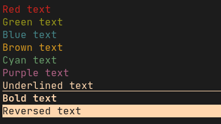
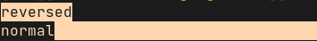
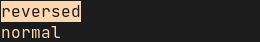

# go-ansi
ANSI escape sequences for Golang



## Install:

```
go get github.com/bit101/go-ansi
```

## Import:

```
import "github.com/bit101/go-ansi"
```

## Functions:

### Set foreground (text) color

```
ansi.SetFg(fg ansiColor) // see below for `ansiColor` type
```

Affects the color of all text rendered with `fmt.Print*` functions. This color will remain active until it is changed or reset.

### Set background color

```
ansi.SetBg(bg ansiColor) // see below for `ansiColor` type
```

Affects the background color of all text rendered with `fmt.Print*` functions. This color will remain active until it is changed or reset.

### Set bold

```
ansi.SetBold(bold bool)
```

Affects whether text will be rendered in bold or regular. This setting will remain active until it is changed or reset.

### Set underline

```
ansi.SetUnderline(underline bool)
```

Affects whether text will be rendered underlined or not. This setting will remain active until it is changed or reset.

### Set reversed

```
ansi.SetReversed(reversed bool)
```

Affects whether text will be rendered with foreground and background reversed. This setting will remain active until it is changed or reset.

### Set all properties

```
ansi.SetAll(fg ansiColor, bg ansiColor, bold bool, underline bool, reversed bool)
```

Sets all of the above properties in one shot.

### ResetAll()

```
ansi.ResetAll()
```

Sets all of the above properties to their default values.

## Print functions

All of the below are "one-shot" functions. They can only be used to set ONE of the following: foreground color, bold, underline, reversed.

The properties selected will only be in effect for the single print call. After the call, all properties will revert to what they were set to with the above functions.

In addition to passing an actual color, such as `ansi.Red` or `ansi.Green`, these functions will accept `ansi.Bold`, `ansi.Underline` and `ansi.Reversed`. If you use one of these three, the default color will be used.

If you use one of the bold colors, such as `ansi.BoldRed`, it has the effect of setting the color to red AND setting the bold flag to true.

Setting the background color is not supported with these methods.

### Print

```
ansi.Print(color ansiColor, message ...any)
```

Behaves exactly like `fmt.Print` but takes an `ansiColor` as a first argument.

### Print line

```
ansi.Println(color ansiColor, message ...any)
```

Behaves exactly like `fmt.Println` but takes an `ansiColor` as a first argument.

### Print formatted

```
ansi.Printf(color ansiColor, formatStr string, args ...any)
```

Behaves exactly like `fmt.Printf` but takes an `ansiColor` as a first argument.

## The ansiColor type

`ansiColor`s are a set of predefined values that encapsule text properties - mostly colors.

### Colors

The following `ansiColor`s define actual colors. They can be used in `ansi.SetFg`, `ansi.SetBg` or any of the `ansi.Print*` functions:

```
ansi.Black
ansi.BoldBlack
ansi.Red
ansi.BoldRed
ansi.Green
ansi.BoldGreen
ansi.Yellow
ansi.BoldYellow
ansi.Blue
ansi.BoldBlue
ansi.Purple
ansi.BoldPurple
ansi.Cyan
ansi.BoldCyan
ansi.White
ansi.BoldWhite
```

Another special color value is:

```
ansi.Default
```

This can be used in all the same places and will set either the foreground or background color to its default value as defined within the terminal emulator / shell / colorscheme.

In addition, the following values can be used in any of the `ansi.Print*` functions and do what you would expect:

```
ansi.Bold
ansi.NotBold
ansi.Underline
ansi.NotUnderline
ansi.Reversed
ansi.NotReversed
```

### Note on bold colors

If you choose one of the bold colors, such as `ansi.BoldGreen`, it has the effect of setting the color to green and bold to true. This is useful for the `ansi.Print*` functions. If you use a bold color in the `ansi.SetFg` function, it will set bold to true even if you previously called `ansi.SetBold(false)`. See the following:

```
ansi.SetBold(false)
ansi.SetFg(ansi.BoldGreen)
fmt.Println("this will be bold green")
```

The order of operations reversed has the opposite effect:

```
ansi.SetFg(ansi.BoldGreen)
ansi.SetBold(false)
fmt.Println("this will just be green")
```

When using the `ansi.SetAll` function, the bold version of the color will be ignored and the bold flag will be based solely on the bold flag that you passed in as the third parameter, as demonstrated below.

```
ansi.SetAll(ansi.BoldGreen, ansi.Default, false, false, false)
fmt.Println("this will just be green")
```

## Movements and Clearing

The following functions provide some ability to move the cursor to different positions in the shell and clear content from the screen. They pretty much do exactly what you would expect.

```
ansi.ClearLine()
ansi.ClearScreen()
ansi.Backspace(n int)
ansi.Tab()
ansi.CarriageReturn()
ansi.NewLine()
ansi.MoveTo(x, y int)
ansi.MoveUp(n int)
ansi.MoveDown(n int)
ansi.MoveRight(n int)
ansi.MoveLeft(n int)
```

## Known issues

If underline, reversed or a background color is set and then unset and a print call forces a scroll, the style may incorrectly extend to the next line. The following code demonstrates this:

```
ansi.SetReversed(true)
fmt.Println("reversed")
ansi.SetReversed(false)
fmt.Println("normal")
```

This is the result once the screen scrolls:



This is more of an underlying issue that is hard to fix within the library because it happens in `fmt.Println`. There is a fix in the library print methods though, so a workaround is to use them, like so:

```
ansi.SetReversed(true)
fmt.Println("reversed")
ansi.SetReversed(false)
ansi.Println(ansi.Default, "normal")
```

The result:


